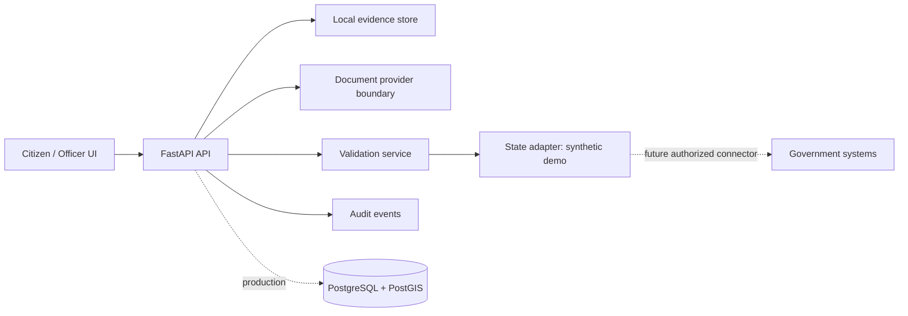
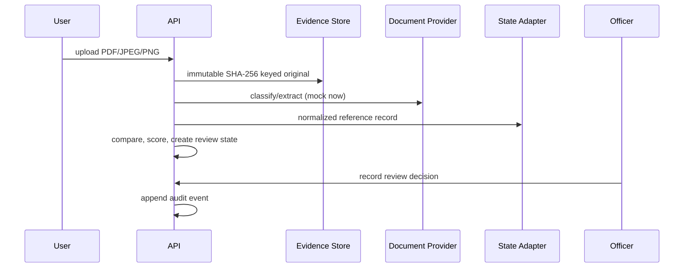

# Architecture

## Principles and Context

Evidence is immutable; authoritative data wins; AI is advisory and explainable; humans decide; personal identity and parcel identity remain separate; external state systems are only accessed through authorized adapters. The current app is a synthetic local demo.

## High-Level Architecture

Frontend is Next.js/TypeScript/Tailwind; it should call `/api/v1` through a typed client and never query storage or DB directly. FastAPI owns HTTP, RBAC, structured errors, and orchestration. Services own hashing, storage keys, extraction, comparison, and audit. State adapters normalize state-specific schemas before values reach core validation.

## Domain and Database

Core entities: User, LandParcel, OwnershipRelationship, MutationEvent, Document, Extraction, ExtractedField, ValidationResult, ReviewCase, and AuditEvent. PostgreSQL/PostGIS is the production persistence target; migration `001_initial.sql` establishes parcel geometry, document provenance, and audit foundations. GeoJSON is used at the API boundary; WKT may be used internally. Geometry is tagged EPSG:4326 until a state adapter supplies an authoritative CRS.

## Processing, AI, Blueprint, and Validation

Provider interfaces isolate PaddleOCR/Tesseract/OpenCV, NLP, layout, and blueprint CV. The present `MockDocumentProvider` is deterministic and explicitly labelled; it can be replaced without modifying validation. Blueprint processing is deferred until a calibrated raster/vector provider and survey-control data are available. Validation preserves both values and marks uncertain/conflicting fields for review.

## Auth, Storage, and API

Current tokens are static demo credentials for repeatable local demonstration; production uses a JWT/OIDC authentication adapter with short-lived sessions. RBAC allows citizens to view/upload only their scope, officers to resolve cases, and administrators to manage configuration. Storage keys are generated from tenant/parcel/content hash/version rather than filenames. APIs are versioned at `/api/v1`, return Pydantic contracts, and surface user-safe errors.

## Deployment, Failure, Scale, and Recovery

Docker Compose provisions Next.js, FastAPI, and PostGIS. Production adds S3-compatible storage, database migrations, worker queues, malware scanning, observability, encrypted backups, restore drills, and regional controls. Failure modes include corrupt upload, provider failure, unavailable adapter, invalid geometry, and stale source; each stops or degrades to REVIEW_REQUIRED, never silent approval. Scale via stateless API replicas, object storage, PostGIS indexes, and async worker queues. Back up database and evidence object versions separately and test restore integrity using stored hashes.
