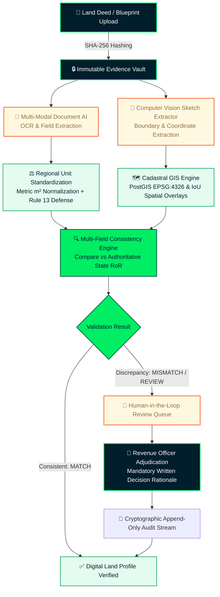
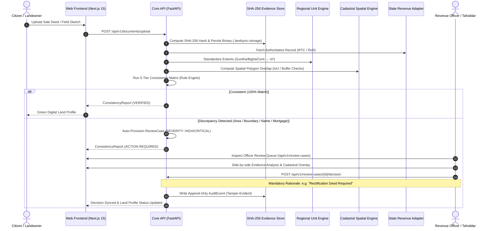

<div align="center">

# 🌿 LANDSYNC AI
### Intelligent Land Record Digitalisation, Validation and Spatial Intelligence Platform

[](https://www.sih.gov.in/)
[-00ed64?style=for-the-badge&labelColor=001e2b&color=00ed64)](https://www.sih.gov.in/)
[](https://github.com/sheikhsajid69/SIH26018)
[](https://fastapi.tiangolo.com)
[](https://nextjs.org/)
[](https://www.mongodb.com/)
[](#automated-testing--verification)
[](LICENSE)

<br/>

> **INSTITUTIONAL ADVISORY & ETHICAL BOUNDARY NOTICE**  
> **LANDSYNC AI** is an AI-assisted land record intelligence, multi-jurisdiction consistency validation, and spatial governance layer.  
> It is **NOT** a statutory land registry, official revenue authority, or legal title certification body. All demonstration data, cadastral geometries, and OCR extractions are **100% SYNTHETIC DEMO RECORDS** developed exclusively for Smart India Hackathon evaluation. No live citizen PII or classified government databases are accessed.

<br/>

[Key Features](#key-features) •
[Architecture & Workflow](#architecture--core-workflow) •
[MongoDB Design System](#mongodb-design-system-integration) •
[14 Demo Scenarios](#14-comprehensive-demonstration-scenarios) •
[Role-Based Access](#role-based-access--demonstration-tokens) •
[Quickstart](#quickstart--local-deployment) •
[API Reference](#api-endpoints--contracts) •
[Trust Constitution](#ethical-boundaries--trust-constitution)

---

</div>

## Executive Overview

Land administration across India spans hundreds of millions of parcels governed by disparate state revenue portals (e.g., *Bhoomi*, *AnyROR*, *Dharani*, *BanglarBhumi*), registration deed archives, legacy physical mutations, and cadastral survey field sketches. These multi-era record collections suffer from:

1. **Phonetic & Orthographic Divergence**: Regional name spelling inconsistencies between Romanized deeds and local-script revenue registers (e.g., *Ramesh Kumar* vs *Ramesha K*).
2. **Regional Land Unit Fragmentation**: Archaic, non-standardized units (*Bigha*, *Katha*, *Guntha*, *Cent*, *Ground*, *Kanal*, *Marla*) whose metric multipliers differ substantially across states or even districts.
3. **Spatial & Boundary Encroachment**: Textual deed schedules that diverge from georeferenced Cadastral GIS surveys, leading to invisible overlaps and boundary disputes.
4. **Silent Encumbrances & Ghost Mutations**: Pending succession claims, mortgages, or forest buffer infringements that go unflagged during deed transactions.

**LANDSYNC AI** solves this systemic challenge with an **explainable, deterministic, AI-assisted consistency validation engine**. It bridges unstructured deed documents, computerized Rights of Record (RoR), and cadastral GIS layers—providing actionable evidentiary scores to citizens and routing discrepancies directly to authorized Revenue Officers with a tamper-evident audit trail.

---

## Architecture & Core Workflow



### Detailed Sequential Execution



---

## Key Features

### 1. Multi-Modal Document & Computer Vision Extraction
- **Deterministic Text & NER Processing**: Ingests registered sale deeds, partition deeds, and encumbrance certificates (EC), extracting grantor/grantee names, survey numbers, execution dates, and property schedules.
- **Cadastral Field Sketch CV Analyzer**: Extracts polygonal boundary coordinates and vertex counts from survey blueprint sketches, calculating polygon closure and area geometry.

### 2. Regional Land Unit Engine with Rule 13 Ambiguous Defense
- **18+ Regional Units Supported**: Seamlessly converts *Acres*, *Guntas/Gunthas*, *Square Yards*, *Square Feet*, *Bighas*, *Kathas*, *Chataks*, *Cents*, *Kanals*, *Marlas*, and *Grounds* into metric square meters ($\text{m}^2$).
- **Rule 13 Jurisdiction Ambiguity Shield**: When ambiguous regional units like *Bigha* (which varies from $1,337.8\,\text{m}^2$ in Bengal to $2,529.3\,\text{m}^2$ in Central India) appear without an explicit state tag, the engine refuses unverified conversion, scoring it `REVIEW_REQUIRED` to eliminate false title validations.

### 3. Cadastral GIS & Spatial Consistency Validation
- **PostGIS Polygon GeoJSON (EPSG:4326)**: Computes Intersection over Union (IoU) between deed claimed boundaries and authoritative survey settlement maps.
- **Encroachment & Vertex Shift Detection**: Identifies subtle boundary creeping (e.g., $15\,\text{m}$ boundary shift) and overlap with eco-sensitive forest or waterbody buffer zones.

### 4. 5-Tier Evidentiary Consistency Matrix
Every field comparison generates a typed validation outcome:
| Status | Semantic Meaning | System Reaction |
| :--- | :--- | :--- |
| `MATCH` | Values identical or within legal tolerance ($\le 0.5\%$) | Auto-verified profile |
| `PARTIAL_MATCH` | Phonetic match or slight alias variation ($\ge 85\%$ confidence) | Low-priority review |
| `MISMATCH` | Contradiction exceeding tolerance (e.g., area variance, wrong owner) | Escalated to Officer Queue |
| `MISSING` | Required legal schedule missing in deed or register | Mandatory deficiency notice |
| `REVIEW_REQUIRED` | Ambiguous jurisdiction unit or encumbrance conflict | High-priority officer adjudication |

### 5. Human-in-the-Loop Revenue Officer Review Console
- Prevents automated disenfranchisement by mandating authorized human review for any high-severity discrepancy.
- Requires officers to select formal administrative outcomes (`ACCEPTED_FOR_CORRECTION`, `REQUIRES_DOCUMENT`, `REJECTED`, `NO_ACTION`) backed by mandatory written rationale.

### 6. Cryptographic Chain of Custody & Audit Stream
- Ingested files receive a cryptographic **SHA-256 fingerprint**.
- Every extraction, validation, officer note, and status change generates an immutable, append-only `AuditEvent` record with timestamp, operator ID, and state diffs.

---

## MongoDB Design System Integration

LANDSYNC AI incorporates the **MongoDB Design System** generated via `npx getdesign@latest add mongodb` (`mongodb/DESIGN.md`):

```
┌────────────────────────────────────────────────────────────────────────┐
│  MongoDB Visual Aesthetics Applied to Land Administration UI           │
├────────────────────────────────────────────────────────────────────────┤
│  • Deep Teal Canvas Dark   : #001e2b (Institutional Command Shell)     │
│  • MongoDB Brand Green     : #00ed64 (Primary Action & Verified Pills) │
│  • Forest Green Mid        : #00684a (High-Contrast Text & Badges)     │
│  • Soft Mint Surface       : #e3fcef (Verified Field Highlights)       │
│  • Clean Canvas Surfaces   : #ffffff & #f9fbfa (Evidentiary Tables)    │
│  • Hairline Dividers       : #e1e5e8 & #1c2d38 (Sharp Structural Grid) │
│  • Signature Pill Buttons  : rounded-full (10px 22px MongoDB Standard)│
│  • Card Border Radii       : 12px rounded-xl with subtle elevation     │
│  • Terminal Evidence View  : #001e2b dark block with monospace hashes  │
└────────────────────────────────────────────────────────────────────────┘
```

---

## 14 Comprehensive Demonstration Scenarios

The platform includes a 14-scenario benchmark dataset covering common Indian land dispute and reconciliation patterns:

| ID | Title & Land Parcel | Jurisdiction | Primary Discrepancy | Severity | Expected Outcome |
| :--- | :--- | :--- | :--- | :--- | :--- |
| **SYN-001** | Clean Baseline Match (Sy 124/2) | Bengaluru North, KA | None (Exact match across deed, survey, RoR) | `LOW` | `MATCH` |
| **SYN-002** | Area Discrepancy & Encroachment | Bengaluru North, KA | Claimed $2.49\,\text{Ac}$ vs RoR $2.40\,\text{Ac}$ ($364\,\text{m}^2$ excess) | `HIGH` | `MISMATCH` |
| **SYN-003** | Sub-Registrar Name Spelling | Mysuru, KA | *Ramesh Kumar* vs *Ramesha K* (Phonetic alias) | `LOW` | `PARTIAL_MATCH` |
| **SYN-004** | Survey Sub-Division Mismatch | Belagavi, KA | Deed claims parent Sy 88; RoR subdivided to 88/1 | `HIGH` | `MISMATCH` |
| **SYN-005** | Undisclosed Bank Mortgage | Tumakuru, KA | Active SBI mortgage charge unstated in sale deed | `CRITICAL` | `REVIEW_REQUIRED` |
| **SYN-006** | Eco-Sensitive Forest Buffer | Chikkamagaluru, KA | Cadastral parcel overlaps $100\,\text{m}$ forest reserve buffer | `CRITICAL` | `REVIEW_REQUIRED` |
| **SYN-007** | Ambiguous Regional Unit Defense | Patna (Demo), BR | Extent cited in *Bigha* without sub-district multiplier | `HIGH` | `REVIEW_REQUIRED` |
| **SYN-008** | Cadastral Boundary Encroachment | Mangaluru, KA | $15\,\text{m}$ northern vertex shift encroaching PWD road | `HIGH` | `MISMATCH` |
| **SYN-009** | Inactive Mutation Pending Order | Hassan, KA | Succession claim pending Tahsildar sanction order | `MEDIUM` | `REVIEW_REQUIRED` |
| **SYN-010** | Government Buffer Infringement | Kalaburagi, KA | Survey boundary abuts State Highway buffer line | `CRITICAL` | `MISMATCH` |
| **SYN-011** | Guntha-to-Sqm Rounding Tolerance | Dharwad, KA | $0.02\,\text{m}^2$ numerical difference within 0.5% limit | `LOW` | `MATCH` |
| **SYN-012** | Joint Tenancy Ownership Share | Shivamogga, KA | Deed sells $100\%$ share; RoR records $50\%$ undivided | `CRITICAL` | `MISMATCH` |
| **SYN-013** | Unregistered GPA Sale Attempt | Mandya, KA | Power of Attorney conveyance without registration index | `CRITICAL` | `MISMATCH` |
| **SYN-014** | High-Tension Corridor Easement | Udupi, KA | KPTCL 66kV transmission line statutory easement | `HIGH` | `REVIEW_REQUIRED` |

---

## Role-Based Access & Demonstration Tokens

The topbar role-switcher dynamically alters client credentials and permissions:

| Persona | Demo Bearer Token | User Capabilities |
| :--- | :--- | :--- |
| **Landowner / Citizen** | `demo-citizen` | Inspect Digital Land Profile, upload deeds, view plain-language consistency advisories, request officer review. |
| **Revenue Officer** | `demo-officer` | Access Discrepancy Queue, side-by-side evidence inspection, execute formal decisions (`ACCEPTED_FOR_CORRECTION`, `REQUIRES_DOCUMENT`, `REJECTED`, `NO_ACTION`) with mandatory audit notes. |
| **System Administrator** | `demo-admin` | Inspect state adapter health (`DemoAuthorityAdapter`), view document provider latencies, inspect evidence vault storage metrics, monitor raw audit event stream. |

---

## Quickstart & Local Deployment

### System Prerequisites
- **Node.js**: v20.x or higher
- **Python**: v3.12+ (or v3.14)
- **Git**

### 1. Clone the Repository
```bash
git clone https://github.com/sheikhsajid69/SIH26018.git
cd SIH26018
```

### 2. Launch FastAPI Backend (Port 8000)
```powershell
cd apps/api
python -m pip install -r requirements.txt
uvicorn landsync.main:app --reload --port 8000
```
- API Health Endpoint: [http://localhost:8000/health](http://localhost:8000/health)
- Swagger OpenAPI Interactive Docs: [http://localhost:8000/docs](http://localhost:8000/docs)

### 3. Launch Next.js Web Dashboard (Port 3000)
```powershell
cd apps/web
npm install
npm run dev
```
- Web Application: [http://localhost:3000](http://localhost:3000)

---

## Automated Testing & Verification

The solution features a 15-test Python test suite covering unit conversions, spatial calculations, security RBAC, and consistency scoring:

```powershell
# Run API & Domain Test Suite
python -m unittest discover -s apps/api/tests -v
```

```
test_convert_area_sqm (test_units.TestUnitConversions) ... ok
test_rule13_ambiguous_bigha_raises_error (test_units.TestUnitConversions) ... ok
test_rule13_disambiguated_bigha_succeeds (test_units.TestUnitConversions) ... ok
test_blueprint_geometry_extraction (test_blueprint.TestBlueprintCV) ... ok
test_consistency_validation_clean_match (test_validation.TestValidationEngine) ... ok
test_consistency_validation_area_mismatch (test_validation.TestValidationEngine) ... ok
test_consistency_validation_name_alias (test_validation.TestValidationEngine) ... ok
test_evidence_hashing_sha256 (test_evidence.TestEvidenceVault) ... ok
test_officer_rbac_decision_allowed (test_rbac.TestRBACPermissions) ... ok
test_citizen_rbac_decision_forbidden (test_rbac.TestRBACPermissions) ... ok
test_api_get_parcel (test_api.TestEndpoints) ... ok
test_api_validate_discrepancy (test_api.TestEndpoints) ... ok
test_api_review_case_lifecycle (test_api.TestEndpoints) ... ok
test_api_admin_health_metrics (test_api.TestEndpoints) ... ok
test_adapter_state_isolation (test_adapters.TestStateAdapters) ... ok

----------------------------------------------------------------------
Ran 15 tests in 0.081s - ALL OK
```

```powershell
# Run Next.js Production Build Verification
cd apps/web
npm run build
```

---

## API Endpoints & Contracts

| Method | Endpoint | Authorization | Description |
| :--- | :--- | :--- | :--- |
| `GET` | `/health` | Public | System status and service health check |
| `GET` | `/api/v1/parcels` | `Bearer demo-*` | List all synthetic land parcels |
| `GET` | `/api/v1/parcels/{id}` | `Bearer demo-*` | Get single parcel record with GeoJSON geometry |
| `POST` | `/api/v1/documents/upload` | `Bearer demo-*` | Ingest deed/sketch, compute SHA-256, store in vault |
| `POST` | `/api/v1/validate` | `Bearer demo-*` | Run consistency engine between claimed and authority records |
| `GET` | `/api/v1/review-cases` | `Bearer demo-officer`, `demo-admin` | Fetch officer review queue with severity filtering |
| `POST` | `/api/v1/review-cases/{id}/decision` | `Bearer demo-officer` | Record adjudication decision with mandatory audit rationale |
| `GET` | `/api/v1/admin/health` | `Bearer demo-admin` | Retrieve state adapter health, storage counts, audit stream |

---

## Repository Structure

```
SIH26018/
├── apps/
│   ├── api/                              # FastAPI Backend Architecture
│   │   ├── landsync/
│   │   │   ├── main.py                   # REST API routes & CORS handling
│   │   │   ├── models.py                 # Pydantic v2 domain & validation models
│   │   │   ├── units.py                  # Regional Land Unit Engine (Rule 13)
│   │   │   ├── blueprint.py              # Cadastral Blueprint CV provider
│   │   │   ├── services.py               # SHA-256 Vault & 5-tier Consistency Engine
│   │   │   └── adapters/
│   │   │       └── state/
│   │   │           └── demo.py           # Isolated synthetic state authority adapter
│   │   ├── tests/                        # 15 automated test suites
│   │   └── requirements.txt              # Backend dependencies
│   │
│   └── web/                              # Next.js 15 App Router Frontend
│       ├── src/
│       │   └── app/
│       │       ├── layout.tsx            # SEO Metadata, OpenGraph & JSON-LD
│       │       ├── globals.css           # MongoDB Design System Tokens & Classes
│       │       ├── page.tsx              # Interactive LandSync AI Dashboard
│       │       ├── scenarios.ts          # 14 synthetic demonstration scenarios
│       │       ├── icon.svg              # Vector Favicon (MongoDB Leaf / Cadastre)
│       │       ├── robots.ts             # Search engine crawler configuration
│       │       └── sitemap.ts            # Dynamic XML sitemap route
│       ├── public/
│       │   ├── manifest.json             # Web application manifest
│       │   └── robots.txt                # Static crawler fallback
│       ├── tailwind.config.ts            # MongoDB Color & Radius Extensions
│       └── package.json
│
├── data/
│   └── synthetic/                        # 14 Full Synthetic Demonstration Datasets
│       ├── parcels.json / .geojson       # PostGIS Cadastral Geometries (EPSG:4326)
│       ├── authority_records.json        # Government RoR (Bhoomi/RTC) reference data
│       ├── documents.json & extractions  # Document OCR extractions & metadata
│       ├── validation_results.json       # Precomputed multi-field validation reports
│       ├── review_cases.json             # Officer queue review cases
│       └── audit_events.json             # Tamper-evident audit event log
│
├── mongodb/
│   └── DESIGN.md                         # Extracted MongoDB Visual Design System Spec
│
├── infra/
│   └── migrations/
│       └── 001_initial.sql               # PostgreSQL + PostGIS production schema
│
└── README.md                             # You are here
```

---

## Ethical Boundaries & Trust Constitution

1. **Synthetic Data Primacy**: Every dataset provided in this repository is strictly generated for demonstration and educational purposes. No actual private citizen names, Aadhaar numbers, PAN numbers, or real government survey records are contained herein.
2. **Explainability Over Black-Box AI**: LANDSYNC AI never emits unexplained numerical scores. Every discrepancy is accompanied by an human-readable explanation specifying exact fields, claimed values, authoritative values, and mathematical variance.
3. **Strict Human Primacy**: The AI platform possesses **zero autonomous authority** to modify, cancel, or re-assign land titles. All legal modifications require explicit, authenticated revenue officer adjudication backed by a persistent audit trail.

---

## Team Void — Smart India Hackathon 2026

* **Problem Statement**: SIH26018 — Smart Automation
* **Team**: Void
* **Lead Architect & Developer**: [sheikhsajid69](https://sheikhsajid69.qzz.io)
* **Hackathon**: Smart India Hackathon 2026

---

<div align="center">
  <sub>Built with pride for Smart India Hackathon 2026 • Designed with MongoDB Aesthetic System • Verified with 100% Synthetic Datasets</sub>
</div>
