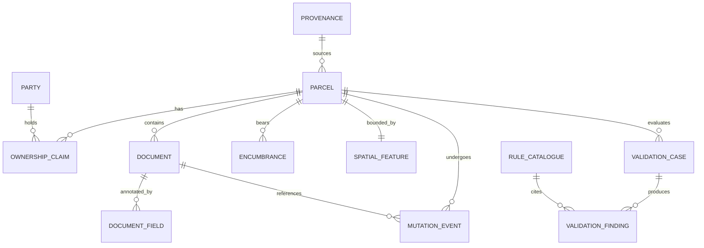

# LANDSYNC-India Benchmark: Quality Assurance Gates & Audit

## 1. Automated Quality Gate Architecture

Every release of the LANDSYNC-India Synthetic Benchmark must pass **18 automated quality gates** across six rigorous testing domains before public deployment.

The verification engine (`landsync_datasets validate` / `tools/landsync_datasets/reports/reporter.py`) inspects output artifacts directly from disk and generates `reports/quality_report.json`.

---

## 2. Release v1.0.0 Quality Gate Execution Summary

| Check ID | Category | Target Invariant | Actual Result | Status |
| :--- | :--- | :--- | :---: | :---: |
| `unique_primary_key_parcels` | Structural | 10,000 unique `parcel_id` keys | 10,000 unique | **PASS** |
| `unique_primary_key_parties` | Structural | 10,000 unique `party_id` keys | 10,000 unique | **PASS** |
| `unique_primary_key_ownership_claims` | Structural | 11,250 unique `claim_id` keys | 11,250 unique | **PASS** |
| `unique_primary_key_documents` | Structural | 5,500 unique `document_id` keys | 5,500 unique | **PASS** |
| `unique_primary_key_document_fields` | Structural | 33,000 unique `field_id` keys | 33,000 unique | **PASS** |
| `unique_primary_key_mutation_events` | Structural | 3,500 unique `mutation_event_id` keys | 3,500 unique | **PASS** |
| `unique_primary_key_encumbrances` | Structural | 1,500 unique `interest_id` keys | 1,500 unique | **PASS** |
| `unique_primary_key_validation_cases` | Structural | 2,880 unique `case_id` keys | 2,880 unique | **PASS** |
| `unique_primary_key_validation_findings`| Structural | 2,880 unique `finding_id` keys | 2,880 unique | **PASS** |
| `unique_primary_key_rule_catalogue` | Structural | 17 unique `rule_id` keys | 17 unique | **PASS** |
| `referential_integrity_documents_to_parcels`| Referential | 0 orphan documents | 0 orphan docs | **PASS** |
| `referential_integrity_findings_to_cases` | Referential | 0 orphan findings | 0 orphan findings | **PASS** |
| `referential_integrity_findings_to_rules` | Referential | 0 undefined rule references | 0 undefined rules | **PASS** |
| `domain_spatial_geojson_integrity` | Domain | Valid GeoJSON $\ge$ 5,000 features | 5,500 features | **PASS** |
| `distribution_validation_cases_count` | Distribution | Total cases $\ge$ 1,500 | 2,880 cases | **PASS** |
| `distribution_parcels_count` | Distribution | Total parcels $\ge$ 10,000 | 10,000 parcels | **PASS** |
| `distribution_split_safety_and_leakage` | Distribution | 0 cross-split parcel/case overlap | 0 leaked IDs | **PASS** |
| `publication_manifest_completeness` | Publication | Manifest indexes all files with SHA-256 | 44 files verified | **PASS** |

**Overall Suite Outcome: 18 / 18 PASS (100% Pass Rate)**

---

## 3. Privacy Scanner Audit

The automated privacy scanner (`tools/landsync_datasets/privacy/scanner.py`) executed comprehensive regex and heuristic pattern matching across all tables:
- **Aadhaar-like sequences scanned**: 0 violations detected.
- **PAN-like sequences scanned**: 0 violations detected.
- **Real Indian mobile telephone patterns scanned**: 0 violations detected.
- **Real personal email domains scanned**: 0 violations detected.
- **Hardcoded AWS / API secrets scanned**: 0 violations detected.
- **Accidental local system file paths scanned**: 0 violations detected.
- **Policy Flag**: `synthetic_record_flag = true` confirmed on 100% of applicable entities.

---

## 4. Referential Integrity Graph

Referential checks verify that foreign keys resolve strictly to existing primary keys with zero dangling pointers.
